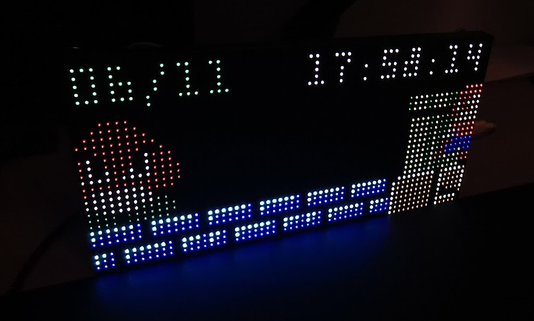

# Matrix Portal M4 Experiment (asyncio)

An experimental LED matrix display using the [AdaFruit Matrix Portal M4](https://www.adafruit.com/product/4745)
controller and a [64x32 MOD75 LED Matrix Panel](https://www.adafruit.com/product/2279) driven using a custom
`asyncio` manager.

#### Video

#### Photos

## Features

- Time and Date display with internet time updates
- Dynamic randomly generated background scenes
  - Floor styles (Brick and Rock) and lengths vary
  - Floor "Underground Level" pallete used at night
  - Warp pipe location varies
- Autonomous Mario and Goomba sprites
  - Mario performs a jumps occasionally
  - Randomly move in and out of scene
  - Background scene sometimes regenerates when both sprites are off screen
- Physical hardware button support
  - Regenerate background scene

## Requirements

- [AdaFruit Matrix Portal M4](https://www.adafruit.com/product/4745) RGB LED matrix controller
- Any compatible 64x32 pixel MOD75 LED matrix panel, such as [AdaFruit 64x32 Matrix](https://www.adafruit.com/product/2279)
- USB-C (5v/3A) power supply or powered hub
- Free [AdaFruit IO](https://io.adafruit.com/) account (for internet time updates)
- WiFi access point

## Usage

Create a Python `virtualenv` and install the [CircUp](https://github.com/adafruit/circup) library manager:

    python -m venv ./venv
    source ./venv/bin/activate
    pip install circup

Connect the Matrix Portal M4 to device and confirm USB device is connected and automatically mounted (e.g. `/media/${USER}/CIRCUITPY`):

    ls /dev/ttyACM0
    ls /media/${USER}/CIRCUITPY

Install project dependencies and libraries using `circup`:

    circup install -r ./requirements.txt

Copy the contents of the `src` directory to the root of your Matrix Portal M4 filesystem (e.g. `/media/${USER}/CIRCUITPY`):

    rsync -rv ./src/ /media/${USER}/CIRCUITPY/

Now create a `secrets.py` file in the same location (e.g. `/media/${USER}/CIRCUITPY/secrets.py`) with the following contents:

    secrets = {
        "ssid": "<wifi-ssid>",
        "password": "<wifi-password>",
        "aio_username": "<adafruit-io-username>",
        "aio_key": "<adafruit-io-api-key>"
    }

- Replace `<wifi-ssid>` and `<wifi-password>` with your WiFi network name (SSID) and WPA password/key
- Replace `<adafruit-io-username>` and `<adafruit-io-api-key>` with your [AdaFruit IO](https://io.adafruit.com/) username and API key

CircuitPython will automatically restart when files are copied to or changed on the device.
